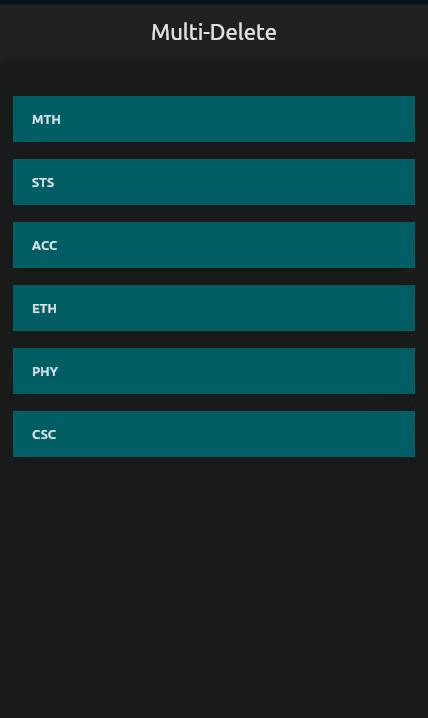

# multi_select
This Flutter app demonstrates how to implement multi-select and delete functionality for a list of items. Users can long-press on any item in the list to activate the selection, and then single-tap to select afterwards. Once the desired items have been selected, tap on the delete button to remove all selected items from the list.

